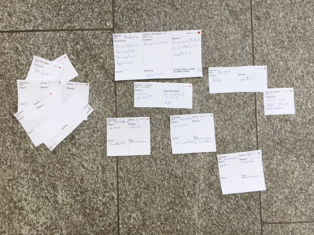

# angular-paper-cards
Paper cards to lay out angular applications and their architecture.

## How to use

1. [download PDF](https://github.com/wingsuitist/angular-paper-cards/raw/master/angular-architecture-cards.pdf), print it and cut out the cards
2. print it and cut out the cards
3. take a card, fill in the boxes as you wish
4. place on the wall or floor to form your application
5. hold your chin with two fingers, tilt your head to a thinking position
6. point to something (shake your head if apropriate), talk to someone, change the card
7. go to point 3.

It's not about perfection, it's about communication and understanding.

--

Improvements and input is welcome. Any new card we should add?

[Sponsored by letsboot.com/angular](http://www.letsboot.com/angular)
